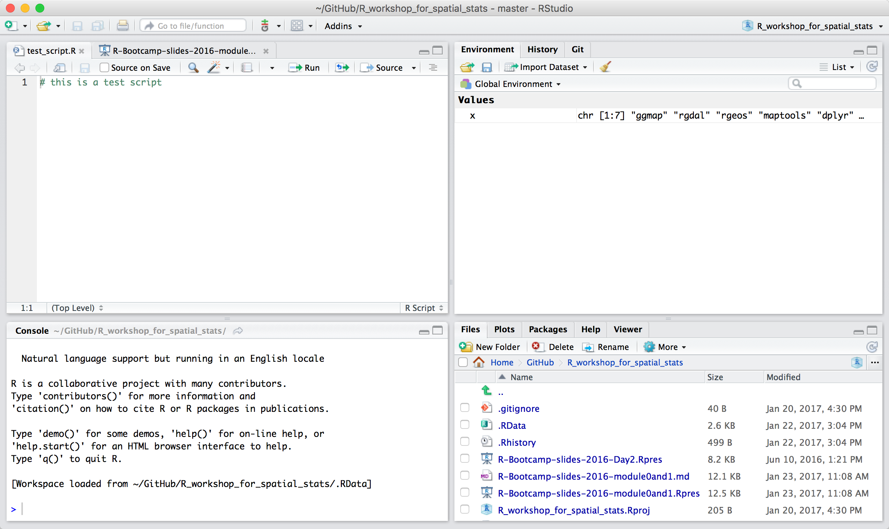

R Seminar for Math 161
========================================================
author: Jeho Park
date: Jan 23, 2017
transition: none

Introduction to R (for Spatial Stats)

Spring 2017

Reference:
========================================================

This seminar is a compact version of HMC R Bootcamp, a 2-day workshop offered during the summer break.
* http://rpubs.com/jepark/hmc-r-bootcamp-2016-day1
* http://rpubs.com/jehoparkhmc/hmc-r-bootcamp-2016-day2 

Some materials were adapted from the following websites:<br>
* R Bootcamp by Jared Knowles: http://jaredknowles.com/r-bootcamp/<br>
* R Bootcamp at Berkely: http://statistics.berkeley.edu/computing/r-bootcamp/

Some Housekeeping Stuff (NEED UPDATE)
========================================================
- **Slides** at http://rpubs.com/jepark/hmc-r-bootcamp-2016-day1
- **R scripts** at http://bit.ly/hmc-r-bootcamp-file
- **Data files** at at http://bit.ly/r-seminar-data-folder 


Agenda
========================================================
* Module 0: Introduction (5 min)
  + What this seminar is about (Goals)
  + About R (General information about R)
  + Getting ready (R environment setup)
* Module 1: R Programming Environment (20 min)
  + RStudio and its functionality
  + R workspace and working directory
  + Using R packages (installing, loading, namespaces)
  + R project
  + Version control using git and github
  
Agenda (Cont. 1)
========================================================
* Module 2: The Basics of R (20 min)
  + General Stuff
  + Workspace of R and simple calculator
  + R Data Structure (R Objects)
  + Converting between different types of objects
  + Getting help online and offline

Agenda (Cont. 2)
========================================================  
* Module 3: Working with Data (20 min)
  + Raw data (CSV files)
  + Data import and export
  + Subsetting
  + Basic graphics
  
* Module 4: Programming in R (10 min)
  + R functions
  + Loops and vectorization
  + Debugging

Module 0: Introduction in 5 min
========================================================
* What is R?
* What is not R?
* Then Why R?
* Getting ready for R Seminar

What is R?
========================================================
* R is a statical and data programming language/environment.
* R is open source/free.
* R is widely used/prefered.
* R is cross-platform.
* R is hard to learn (really?).

What is not R?
========================================================
* S: R's ancestor
* S-Plus: Commercial; modern implementation of S
* SAS: Commercial; widely used in the commercial analytics.  
* SPSS: Commercial; easy to use; widely used in Social Science.
* MATLAB: Commercial; can do some Stats. 
* Python: Also can do some Stats; good in text data manipulation.

Then Why R?
========================================================
* R community is active and constantly growing
* R is most popular (other than SPSS and SAS)
* R has tons of user generated libraries/packages
* R code is easily shared with others
* R is constantly improved

###### Further reading about R's popularity in science and engineering:<br>
###### R moves up to 5th place in IEEE language rankings at  https://www.r-bloggers.com/r-moves-up-to-5th-place-in-ieee-language-rankings/

Getting Ready!
========================================================
* Check R  
* Check RStudio  
* Check slides  
* Check check check...

Module1: R Programming Environment
========================================================
## RStudio and its functionality
* Integrated Development Environment for R
* Nice combination of GUI and CLI
* Free and commercial version
* 4 main windows, tabs, etc
* Version control: Git and VPN
* R Markdown
* R Presentation

RStudio Panes
========================================================



R Programming Environment (cont.)
========================================================
## R Workspace
  + Current R working environment including any user-defined objects
  + Save and load workspace

```r
  save.image("r-seminar.Rdata") # save workspace  
  rm(list=ls()) # remove all objects
  load("r-seminar.Rdata") # bring the workspace back
  save.image() # by default it saves workspace to .Rdata 
```

R Programming Environment (cont.)
========================================================
## R working directory
  + the folder where R extracts and save files
  + getwd() and setwd()

```r
curr_wd <- getwd() # returns absolute path to the working directory
setwd("data") # change working directory to data folder
setwd(file.path('~', 'Desktop'))
```

R Programming Environment (cont.)
=========================
## R Packages
* Installing packages
* Loading and attaching packages
  + library() v.s. require()
* Pakcage namespace

```r
require("datasets") # load/attach datasets if the package exists
ls('package:datasets') 
airmiles # airmiles object in datasets package
airmiles <- 0 # Oops! overwritten?
datasets::airmiles # package namespace
rm(airmiles) # removes user defined object airmiles
```

R Programming Environment (cont.)
=========================
+ R project
+ Version control with git and github/bitbucket

Module 1: The Basics of R (25 min)
========================================================
* General stuff
* Workspace of R and some calculations
* R Objects (Vectors, Matrices, Lists, Data frames, and Factors)
* Converting between different types of objects
* Getting help online and offline

General Stuff
========================================================

```r
demo() # display available demos
```

```r
demo(graphics) # try graphics demo
```

```r
library() # show available packages on the computer
```

```r
search() # show loaded packages
```

```r
?hist # search for the usage of hist function
```

```r
??histogram # search for package documents containing the word "histogram"
```


Workspace of R
========================================================

R workspace stores objects like vectors, datasets and functions in memory (the available space for calculation is limited to the size of the RAM).


```r
a <- 5 # notice a in your Environment window
```


```r
A <- "text" 
```


```r
a
A
ls()
print(c(a,A))
print(a, A)
```

Look Ma, R can do Math! 
========================================================

```r
1+1
```


```r
2+runif(1,0,1)
```


```r
2+runif(1,min=0,max=1)
```


```r
3^2
```


```r
3*3
```


```r
sqrt(3*3) # comments
```


```r
# comments are preceded by hash sign
```

Even More Math! 
========================================================
* R can take integrals and derivatives, for example:

Numerical Integral of

$\displaystyle\int_0^{\infty} \frac{1}{(x+1)\sqrt{x}}dx$ 


```r
integrand <- function(x) {1/((x+1)*sqrt(x))} ## define the integrated function
```

```r
integrate(integrand, lower=0, upper=Inf) ## integrate the function from 0 to infinity
```

```
3.141593 with absolute error < 2.7e-05
```


R Objects: Vectors
========================================================
The most basic form of an R object.  
Scalar values are __vectors of length one__.  
A vector is an array object of the __same type__ (homogeneous) data elements.


```r
class(a)
class(A)
B <- c(a,A) # concatenation function
B # see the values
class(B) # why?
```

```r
a <- rnorm(10)
a[3:5] <- NA # NA is a missing value
a
```

R Objects: Vectors (cont.)
========================================================
R has five basic or “atomic” classes of objects: 
* character
* numeric (real numbers) 
* integer
* complex
* logical (True/False)

A vector contains a set of data in any one of the atomic classes.


R Objects: Matrices
========================================================
A matrix is a two-dimensional rectangular object of the __same type__ (homogeneous) data elements. 


```r
mat <- matrix(rnorm(6), nrow = 3, ncol = 2) 
mat # a matrix
dim(mat) # dimension
t(mat) # transpose
summary(mat) 
```

R Objects: Lists
========================================================
A list is an object that can store __different types__ of vectors. 

```r
aList <- list(name=c("Joseph"), married=T, kids=2)
aList
aList$kids <- aList$kids+1
aList$kids
aList2 <- list(numeric_data=a,character_data=A)
aList2
allList <- list(aList, aList2)
allList
```

R Objects: Data frames
========================================================
A data frame is a __list of vectors of equal length__ with possibly different types. It is used for storing retengular data tables (where columns are variables and rows are observations).

```r
n <- c(2, 3, 5) # a vector 
s <- c("aa", "bb", "cc") # a vector
b <- c(TRUE, FALSE, TRUE) # a vector
df <- data.frame(n, s, b) # a data frame
df
class(df$s) # was a string vector but now a factor column. why?
mtcars # a built-in (attached) data frame
mtcars$mpg
```

R Objects: Data frames (cont.)
========================================================

```r
myFrame <- data.frame(y1=rnorm(100),y2=rnorm(100), y3=rnorm(100))
head(myFrame) # display first few lines of data
names(myFrame) # display column names
summary(myFrame) # output depends on the data types
plot(myFrame)
myFrame2 <- read.table(file="http://scicomp.hmc.edu/data/R/Rtest.txt", header=T, sep=",")
myFrame2
```

R Objects: Factors
========================================================
* Factors are a special compound object used to represent __categorical data__ such as gender, social class, etc.
* Factors have 'levels' attribute. They may be nominal or ordered.

```r
v <- c("a","b","c","c","b")
x <- factor(v) # turn the character vector into a factor object
z <- factor(v, ordered = TRUE) # ordered factor
x
z
table(x)
```


Converting between different types
==============================================
Use of the as() family of functions. Type as. and wait to see the list of as() functions.

```r
integers <- 1:10
as.character(integers)
as.numeric(c('3.7', '4.8'))
```

```r
indices <- c(1.7, 2.3)
integers[indices] # sometimes R is too generous
integers[0.999999999] # close to 1 but...
```

```r
df <- as.data.frame(mat)
df
```

Getting help online and offline
===============================
* Rseek meta search engine: http://rseek.org/ 
* R-help listserv: https://www.r-project.org/mail.html
* Stack Overflow: http://stackoverflow.com/questions/tagged/r
* Cross-Validated: the statistics Q&A site http://stats.stackexchange.com/
* Contact CIS: helpdesk@hmc.edu or jepark@hmc.edu
* HMC R Users Group: r-users-l@g.hmc.edu

Module 2: Working with Data
=============================
* Working with raw data (text files)
* Data import and export
* Subsetting
* Basic graphics

Working with Raw Data (text files)
==============================
* Use read.table() to read text files into R
* Try help document for read.table()

## Getting ready: 
###### Make a new directory named "data" under your working directory
###### Download data files from http://bit.ly/r-seminar-data-folder to the directory

Data Import
==============================
* read.csv() is a special case of read.table() 
* Data import from your local folder (via R console)

```r
cpds <- read.csv(file.path('.', 'data', 'cpds.csv'))
head(cpds) # good to look at a few lines
class(cpds) # data.frame
```
* Data import from the Internet

```r
data <- read.table(file="http://scicomp.hmc.edu/data/R/normtemp.txt", header=T)
tail(data)
```

Data Import (Cont.)
================================

```r
rta <- read.table("./data/RTADataSub.csv", sep = ",", head = TRUE)
dim(rta)
rta[1:5, 1:5]
class(rta)
class(rta$time) # what? let's see ?read.table more carefully
```

```r
rta2 <- read.table("./data/RTADataSub.csv", sep = ",", head = TRUE, stringsAsFactors = FALSE)
class(rta2$time)
```

Data Export
=============================
* Use write.table() to write data to a CSV file

```r
write.csv(data, file = "temp.csv", row.names = FALSE) 
```
* Writing out plots

```r
pdf('myplot.pdf', width = 7, height = 7) # call pdf() before calling plot()
x <- rnorm(10); y <- rnorm(10)
plot(x, y)
dev.off()
```

Subsseting
=========================
Operators that can be used to extract subsets of R objects.
* '[' and ']' always returns an object of the same class as the original; can be used to select more than one element.
* '[[' and ']]' is used to extract elements of a list or a data frame; it can only be used to extract a single element.
* $ is used to extract elements of a list or data frame by name.

Subsetting (cont.)
==========================

```r
x <- c("a", "b", "c", "c", "d", "a")
x[1]
x[1:4]
x[x > "a"] 
u <- x > "a" # what's u here?
u
x[u] # subsetting using a boolean vector
y <- list(foo=x, bar=x[u]) 
y
y[[1]]
y$bar
```

```r
subset(mtcars, gear == 5) # use of subset function for data frames
```

Graphics (base graphics)
=============================
* Creating a graph

```r
attach(mtcars) # Attach mtcars to search path
plot(wt, mpg) # notice objects are called by their names, not mtcars$wt
plot(wt, mpg, 
     main = "Regression of MPG on Weight",
     xlab = "Weight", 
     ylab = "MPG")
plot(wt, mpg, ann = FALSE) 
```
* Changing/adding the details afterwards

```r
abline(h=25) # a reference line
abline(lm(mpg~wt)) # look at the argument, what's lm?
title(main = "Regression of MPG on Weight", xlab = "Weight", ylab = "MPG")
```
 
Manipulating graphs (base package)
=============================
* par() customizes many features of graphs such as fonts, colors, axes, and titles
* par(optionname=value, optionname=value, ...)

```r
par()              # view current settings
orig_par <- par()  # save current settings
par(col.lab="red") # red x and y labels 
plot(wt, mpg)      # create a plot with these new settings 
par(orig_par)      # restore original settings
plot(wt, mpg)
plot(wt, mpg, col.lab="red") # change settings withing plot()
```

```r
?par # see all the options
```

Module 4: Programming in R
===================
* Functions
* Loops and vectorization
* if-else
* Debugging

User-defined Functions
===================
* Modulize your code by encapsulating a set of operations
* Eliminate redundancy
* Increase readability

User-defined Functions (cont)
====================

```r
mult_fun <- function(a = 1, b = 1) {
  return(a*b)
}

mult_fun  # show the function's code
mult_fun(2,3) # function call
mult_fun() # would this be an error?
```
* A function returns the last value operated
* A function returns only one object; use a list to return multiple objects
* Every operation in R is a function call

```r
x <- 10; y <- 20
x + y
`+`(x, y)
```

Loops
==================
* For loops

```r
for(i in 1:10) {
  print(i)
}
```

* While loops

```r
i <- 0
while(i < 5) {
  i <- i + 1 
  print(i)
}
```

Vectorization
====================

```r
########## a bad loop, with 'growing' data
set.seed(42);
m=1000; n=1000;
mymat <- replicate(m, rnorm(n)) # create matrix of normal random numbers
system.time(
  for (i in 1:m) {
    for (j in 1:n) {
      mymat[i,j] <- mymat[i,j] + 10*sin(0.75*pi)
    }
  }
)
```


```r
#### vectorized version
set.seed(42);
m=1000; n=1000;
mymat1 <- replicate(m, rnorm(n))
system.time(
  mymat1 <- mymat1 + 10*sin(0.75*pi)
)
```

Debugging R Code
===================
* Stopping on a line
  + Editor breakpoints
  + browser() breakpoints
  + When an error occurs
  + debug()
  + options(error = browser) / options(error = NULL) 

* Read https://support.rstudio.com/hc/en-us/articles/205612627-Debugging-with-RStudio

Good Coding Style Practices
======================
* Always give meaningful names
  + fit-models.R instead of foo.r
  + day_1 instead of d1
* Spacing around all infix operators (=, +, -, *, etc)
  + average <- mean(feet / 12 + inches, na.rm = TRUE)
  + average<-mean(feet/12+inches,na.rm=TRUE)
* Always indent the code inside curly braces.

```r
if (y < 0 && debug) {
  message("Y is negative")
} else {
  message("Y is not negative")
}
```
